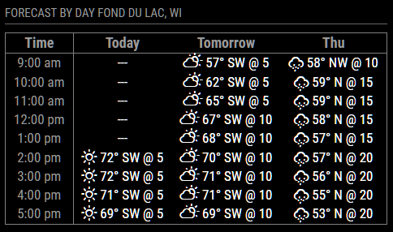

# MMM-WeatherHourlyByDay
## This module for MagicMirror² displays an Hourly Forecast table for multiple days.  Allows you to specify what hours of the day to include and which forecast components will be displayed (icon, temperature, windspeed, wind direction).

## Requires:
- A MagicMirror weather module that provides hourly forecast data.
- That module must broadcast a "WEATHER_UPDATED" notification with a payload of type WeatherObject, containing the hourly weather data.



## Manual install
Go To ```MagicMirror/modules``` folder and then:
```
git clone https://github.com/dWoolridge/MMM-WeatherHourlyByDay.git
cd MMM-WeatherHourlyByDat
npm install
```
## Configuration:
```
    {
      module: "MMM-WeatherHourlyByDay",
      position: "top_left",
      hiddenOnStartup: false,
      header: "Forecast by Day",
      config: {
        roundTemp: true,               // Round temperature to integer
        showLocationInHeader: true,    // Show the WeatherObject.location text with the header
        dailyStartHour: 9,             // Hour of the day to start showing the weather forecast (0-23)
        dailyEndHour:   17,            // Hour of the day to stop showing the weather forecase (0-23)
        daysToShow:     3,             // Number days to show in the table (each day is a column)

        showWeatherIcon: true,         // Include the forecast weather Icon for each time
        showTemperature: true,
        showWindSpeed:  true,
        showWindDirection: true,
      }
```
## Collaborate
Pull requests are welcome.

## Thanks to
rejas for his help in how to implement this weather module.

## TO DO
